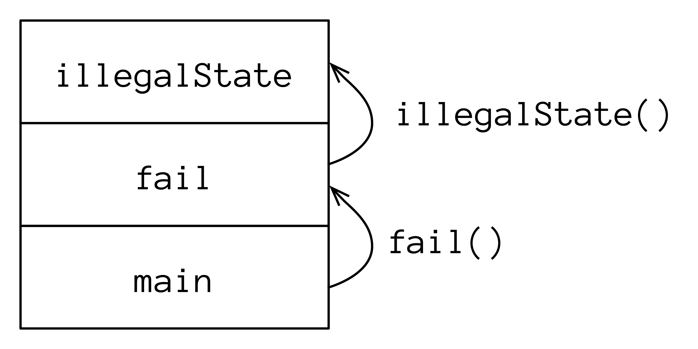
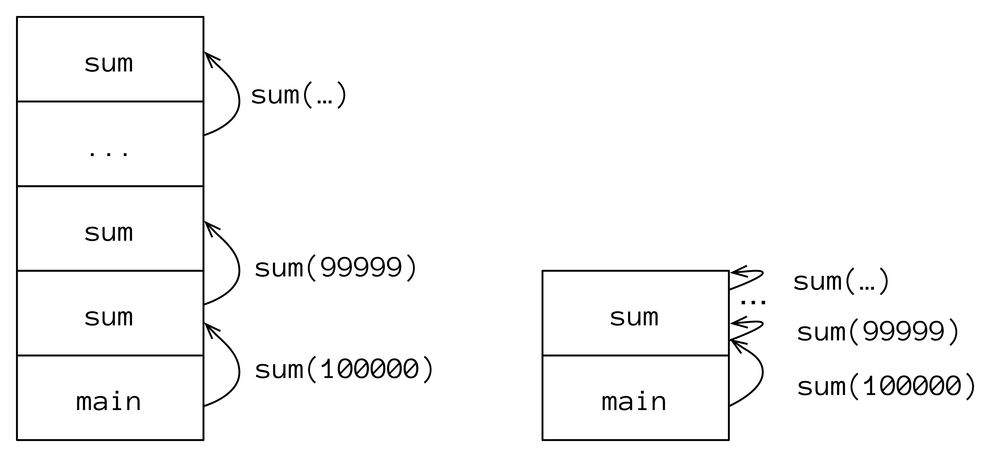
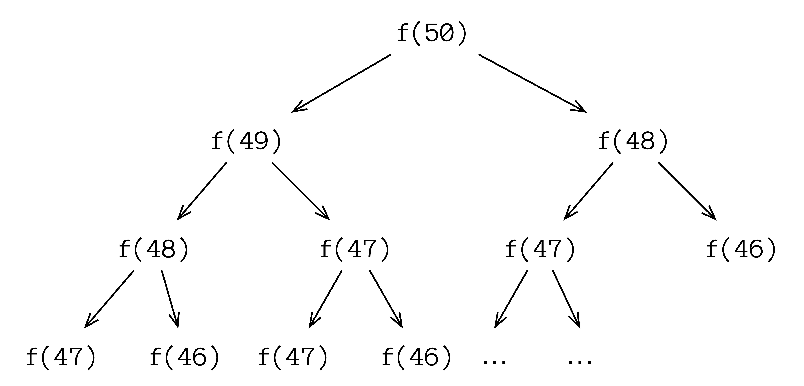

# Recursion

> *Recursion* is the programming technique of calling a function within that same function. *Tail recursion* is an optimization that can be explicitly applied to some recursive functions.

A recursive function uses the result of the previous recursive call. Factorials are a common example—`factorial(n)` multiplies all numbers from `1` to `n`, and can be defined like this:

- `factorial(1)` is `1`
- `factorial(n)` is `n * factorial(n - 1)`

`factorial()` is recursive because it uses the result from the same function applied to its modified argument. Here’s a recursive implementation of `factorial()`:

```
// Recursion/Factorial.kt
package recursion
import atomictest.eq

fun factorial(n: Long): Long {
  if (n <= 1) return 1
  return n * factorial(n - 1)
}

fun main() {
  factorial(5) eq 120
  factorial(17) eq 355687428096000
}
```

While this is easy to read, it’s expensive. When calling a function, the information about that function and its arguments are stored in a *call stack*. You see the call stack when an exception is thrown and Kotlin displays the *stack trace*:

```
// Recursion/CallStack.kt
package recursion

fun illegalState() {
  // throw IllegalStateException()
}

fun fail() = illegalState()

fun main() {
  fail()
}
```

If you uncomment the line containing the exception, you’ll see the following:

```
Exception in thread "main" java.lang.IllegalStateException
  at recursion.CallStackKt.illegalState(CallStack.kt:5)
  at recursion.CallStackKt.fail(CallStack.kt:8)
  at recursion.CallStackKt.main(CallStack.kt:11)
```

The stack trace displays the state of the call stack at the moment the exception is thrown. For `CallStack.kt`, the call stack consists of only three functions:

<div align="center">
  
  <p>The Call Stack </p>
</div>


We start in `main()`, which calls `fail()`. The `fail()` call is added to the call stack along with its arguments. Next, `fail()` calls `illegalState()`, which is also added to the call stack.

When you call a recursive function, each recursive invocation adds a frame to the call stack. This can easily produce a `StackOverflowError`, which means that your call stack became too large and exhausted the available memory.

Programmers commonly cause `StackOverflowError`s by forgetting to terminate the chain of recursive calls—this is *infinite recursion*:

```
// Recursion/InfiniteRecursion.kt
package recursion

fun recurse(i: Int): Int = recurse(i + 1)

fun main() {
  // println(recurse(1))
}
```

If you uncomment the line in `main()`, you’ll see a stacktrace with many duplicate calls:

```
Exception in thread "main" java.lang.StackOverflowError
at recursion.InfiniteRecursionKt.recurse(InfiniteRecursion.kt:4)
at recursion.InfiniteRecursionKt.recurse(InfiniteRecursion.kt:4)
...
at recursion.InfiniteRecursionKt.recurse(InfiniteRecursion.kt:4)
```

The recursive function keeps calling itself (with a different argument each time), and fills up the call stack:

<div align="center">
  
  <p>Infinite Recursion</p>
</div>

Infinite recursion always ends with a `StackOverflowError`, but you can produce the same result *without* infinite recursion, simply by making enough recursive function calls. For example, let’s sum the integers up to a given number, recursively defining `sum(n)` as `n + sum(n - 1)`:

```
// Recursion/RecursionLimits.kt
package recursion
import atomictest.eq

fun sum(n: Long): Long {
  if (n == 0L) return 0
  return n + sum(n - 1)
}

fun main() {
  sum(2) eq 3
  sum(1000) eq 500500
  // sum(100_000) eq 500050000       // [1]
  (1..100_000L).sum() eq 5000050000  // [2]
}
```

This recursion quickly becomes expensive. If you uncomment line **[1]**, you’ll discover that it takes far too long to complete, and all those recursive calls overflow the stack. If `sum(100_000)` still works on your machine, try a bigger number.

Calling `sum(100_000)` causes a `StackOverflowError` by adding `100_000` `sum()` function calls to the call stack. For comparison, line **[2]** uses the `sum()` library function to add the numbers within the range, and this does not fail.

To avoid a `StackOverflowError`, you can use an iterative solution instead of recursion:

```
// Recursion/Iteration.kt
package iteration
import atomictest.eq

fun sum(n: Long): Long {
  var accumulator = 0L
  for (i in 1..n) {
    accumulator += i
  }
  return accumulator
}

fun main() {
  sum(10000) eq 50005000
  sum(100000) eq 5000050000
}
```

There’s no risk of a `StackOverflowError` because we only make a single `sum()` call and the result is calculated in a `for` loop. Although the iterative solution is straightforward, it must use the mutable state variable `accumulator` to store the changing value, and functional programming attempts to avoid mutation.

To prevent call stack overflows, functional languages (including Kotlin) use a technique called *tail recursion*. The goal of tail recursion is to reduce the size of the call stack. In the `sum()` example, the call stack becomes a single function call, just as it did in `Iteration.kt`:

<div align="center">
  
  <p>Regular Recursion vs. Tail Recursion</p>
</div>

To produce tail recursion, use the `tailrec` keyword. Under the right conditions, this converts recursive calls into iteration, eliminating call-stack overhead. This is a compiler optimization, but it won’t work for just any recursive call.

To use `tailrec` successfully, recursion must be the final operation, which means there can be no extra calculations on the result of the recursive call before it is returned. For example, if we simply put `tailrec` before the `fun` for `sum()` in `RecursionLimits.kt`, Kotlin produces the following warning messages:

- *A function is marked as tail-recursive but no tail calls are found*
- *Recursive call is not a tail call*

The problem is that `n` is combined with the result of the recursive `sum()` call *before* returning that result. For `tailrec` to be successful, the result of the recursive call must be returned without doing anything to it during the return. This often requires some work in rearranging the function. For `sum()`, a successful `tailrec` looks like this:

```
// Recursion/TailRecursiveSum.kt
package tailrecursion
import atomictest.eq

private tailrec fun sum(
  n: Long,
  accumulator: Long
): Long =
  if (n == 0L) accumulator
  else sum(n - 1, accumulator + n)

fun sum(n: Long) = sum(n, 0)

fun main() {
  sum(2) eq 3
  sum(10000) eq 50005000
  sum(100000) eq 5000050000
}
```

By including the `accumulator` parameter, the addition happens during the recursive call and you don’t do anything to the result except return it. The `tailrec` keyword is now successful, because the code was rewritten to delegate all activities to the recursive call. In addition, `accumulator` becomes an immutable value, eliminating the complaint we had for `Iteration.kt`.

`factorial()` is a common example for demonstrating tail recursion, and is one of the exercises for this atom. Another example is the Fibonacci sequence, where each new Fibonacci number is the sum of the previous two. The first two numbers are `0` and `1`, which produces the following sequence: `0, 1, 1, 2, 3, 5, 8, 13, 21 ...` This can be expressed recursively:

```
// Recursion/VerySlowFibonacci.kt
package slowfibonacci
import atomictest.eq

fun fibonacci(n: Long): Long {
  return when (n) {
    0L -> 0
    1L -> 1
    else ->
      fibonacci(n - 1) + fibonacci(n - 2)
  }
}

fun main() {
  fibonacci(0) eq 0
  fibonacci(22) eq 17711
  // Very time-consuming:
  // fibonacci(50) eq 12586269025
}
```

This implementation is terribly inefficient because the previously-calculated results are not reused. Thus, the number of operations grows exponentially:

<div align="center">
  
  <p>Inefficient Computation of Fibonacci Numbers</p>
</div>

When computing the 50th Fibonacci number, we first compute the 49th and 48th numbers independently, which means we compute the 48th number twice. The 46th number is computed as many as 4 times, and so on.

Using tail recursion, the calculations become dramatically more efficient:

```
// Recursion/Fibonacci.kt
package recursion
import atomictest.eq

fun fibonacci(n: Int): Long {
  tailrec fun fibonacci(
    n: Int,
    current: Long,
    next: Long
  ): Long {
    if (n == 0) return current
    return fibonacci(
      n - 1, next, current + next)
  }
  return fibonacci(n, 0L, 1L)
}

fun main() {
  (0..8).map { fibonacci(it) } eq
    "[0, 1, 1, 2, 3, 5, 8, 13, 21]"
  fibonacci(22) eq 17711
  fibonacci(50) eq 12586269025
}
```

We could avoid the local `fibonacci()` function using default arguments. However, default arguments imply that the user can put other values in those defaults, which produce incorrect results. Because the auxiliary `fibonacci()` function is a local function, we don’t expose the additional parameters, and you can *only* call `fibonacci(n)`.

`main()` shows the first eight elements of the Fibonacci sequence, the result for 22, and finally the 50th Fibonacci number that is now produced very quickly.

***Exercises and solutions can be found at www.AtomicKotlin.com.***